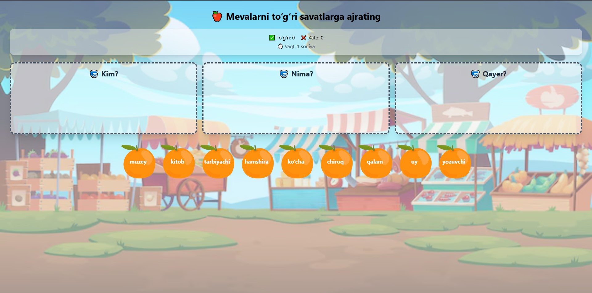

# 🍎 Mevalarni To‘g‘ri Savatlarga Ajrating

Bu loyiha o‘quvchilarga **so‘z turkumlarini (Kim? Nima? Qayer?)** o‘rganishda yordam beruvchi o‘yin tarzidagi veb-ilovadir. Foydalanuvchilar har bir so‘zni to‘g‘ri savatga ajratish orqali bilimlarini mustahkamlashadi.

---

## 🎮 O‘yin Qoidalari

- Har bir so‘z **Kim?**, **Nima?** yoki **Qayer?** savatiga tegishli.
- Foydalanuvchi to‘g‘ri savatga tashlasa, ✅ **to‘g‘ri javob** bo‘ladi.
- Noto‘g‘ri joylashtirilgan so‘z uchun ❌ **xato javob** hisoblanadi.
- O‘yin yakunida statistik natijalar ko‘rsatiladi:
  - To‘g‘ri javoblar soni
  - Noto‘g‘ri javoblar soni
  - O‘yin davomiyligi (sekundlarda)

---

## 📦 Texnologiyalar

- [React.js](https://reactjs.org/)
- [Tailwind CSS](https://tailwindcss.com/)
- [Framer Motion](https://www.framer.com/motion/) — animatsiyalar uchun
- HTML5 Drag & Drop API
- Custom Sound effektlar (to‘g‘ri va noto‘g‘ri javoblar uchun)

---

## 🚀 Ishga Tushirish

1. **Loyihani klonlang:**

   ```bash
   git clone https://github.com/Yagafarov/turkumot.git
   cd turkumot
   ```

2. **Bog‘liqliklarni o‘rnating:**

   ```bash
   npm install
   ```

3. **Ilovani ishga tushiring:**

   ```bash
   npm run dev
   ```

4. Brauzerdan oching:  
   [http://localhost:5173](http://localhost:5173)

---

## 📁 Loyihaning Tuzilishi

```bash
.
├── public/
├── src/
│   ├── assets/              # Mevalar yoki fon rasmlari
│   ├── components/          # WordItem, Basket, Scoreboard va h.k.
│   ├── data/words.json      # So‘zlar ro‘yxati
│   ├── pages/Game.jsx       # Asosiy o‘yin sahifasi
│   ├── utils/sound.js       # To‘g‘ri/xato ovozlar
│   └── main.jsx
├── README.md
└── package.json
```

---

## 📱 Moslashuvchan Dizayn

- **Mobil telefonlarda**: so‘zni tanlab, savatni bosish orqali joylashtirish mumkin
- **Kompyuterda**: Drag & Drop ishlaydi
- Animatsiyalar orqali foydalanuvchiga yoqimli interfeys yaratilgan

---

## ⚙️ Sozlamalar

O‘yinni boshlashdan oldin foydalanuvchi **mevalar sonini (default: 9)** tanlashi mumkin.

---

## ✨ Ekran Ko‘rinishi



---

## 📚 Foydali Bilimlar

Ushbu o‘yin orqali bolalar quyidagilarni o‘rganadi:

- So‘z turkumlari farqlari (Ot, joy, predmet)
- Diqqatni jamlash
- Mustaqil ravishda analiz qilish

---
